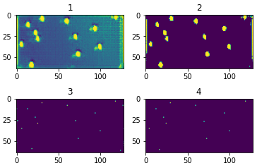

# AI project of tracking balls on a billiard table

## Dataset

The dataset generation is done using Blender opensource software.
The modelisation and the generation are handle in the [final_modelisation_w_script.blend](Pool_Table/final_modelisation_w_script.blend) file. This modelisation is done without using HDR lights.

A new version with HDR lights is available in the [final_modelisation_w_script_HDR.blend](Pool_Table/final_modelisation_w_script_HDR.blend) file. This has be done by Martin PUJOL ([@lapujpuj](https://github.com/lapujpuj)), UROP student at the DVIC.

The dataset is composed of 10 000 pictures of randomly generated images.

## Artificial Intelligence
### General introduction

The input is a 3 channel image of resolution 128x64 (output of Blender).
The target is a 1 channel image of resolution 128x64 with 1 where the balls are and 0 elsewhere.
The output is a 1 channel image of resolution 128x64, kind of a heatmap.

The logging is done on WanDB tool.

### U-NET
There are 3 version of the u-net model :
- [Ball_tracking_u-net_V1.ipynb](u_net_version/Ball_tracking_u-net_V1.ipynb), is a classical U-Net with 4 down and 4 up. This one has been down following the github repository [github is down](githubisdown) 
 - [Ball_tracking_u-net_V2.ipynb](u_net_version/Ball_tracking_u-net_V2.ipynb), is a fully connected U-Net with 4 convolutional layers up and down. Homemade version.
Before going up, there is a MLP with 3 linear layers.
 - [Ball_tracking_u-net_V3.ipynb](u_net_version/Ball_tracking_u-net_V3.ipynb), is a fully connected U-Net with 4 convolutional layers up and down. The same as V2 but without the MLP

#### Training

The loss function is the BSEWithLogits.

The training is done on 7500 images and the validation on 2 500 images.
The training is done on 300 epochs with a batch size of 64, 128 or 256.

#### Results
#### V1
Results of of the V1 AI :

1. Raw output of the model
2. The output of the model after a threshold filter
3. Extraction of the maximum value of the local cluster
4. The target

Speed : 1sec/iteration on google Colab. 
Precision : Between 3 and 4 pixels in mean euclidian distance. 
Model Weight : 246.06 MB with 31,037,633 parameters.

### RESNET
## Documentation

All the project is explained on the [project_report.pdf](project_report.pdf) file.
The whole logging of the AI has been down using Wandb : [https://wandb.ai/sn00wden/simplest_IA](https://wandb.ai/sn00wden/simplest_IA)
